# ThingsBoard IoT Gateway 架构图示

本文档使用Mermaid图表展示ThingsBoard IoT Gateway的各种架构视图。

## 1. 整体系统架构

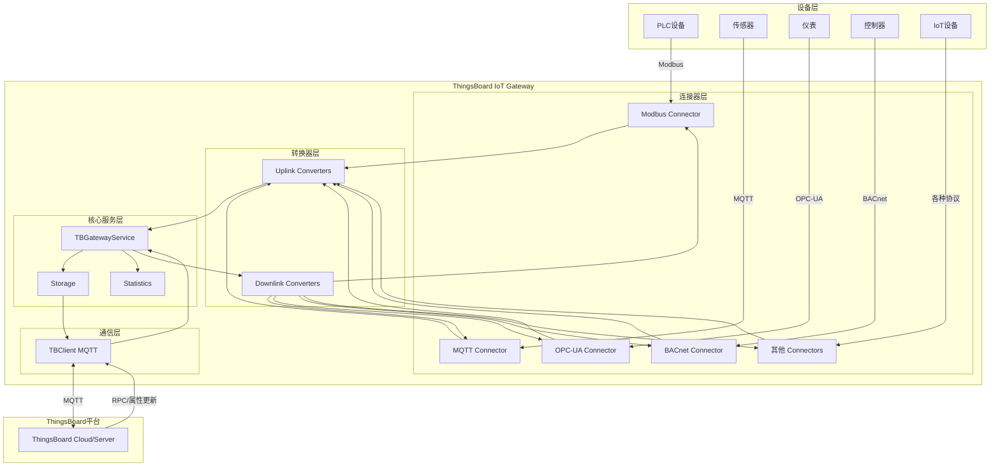

## 2. 数据流程图

### 上行数据流（设备→平台）

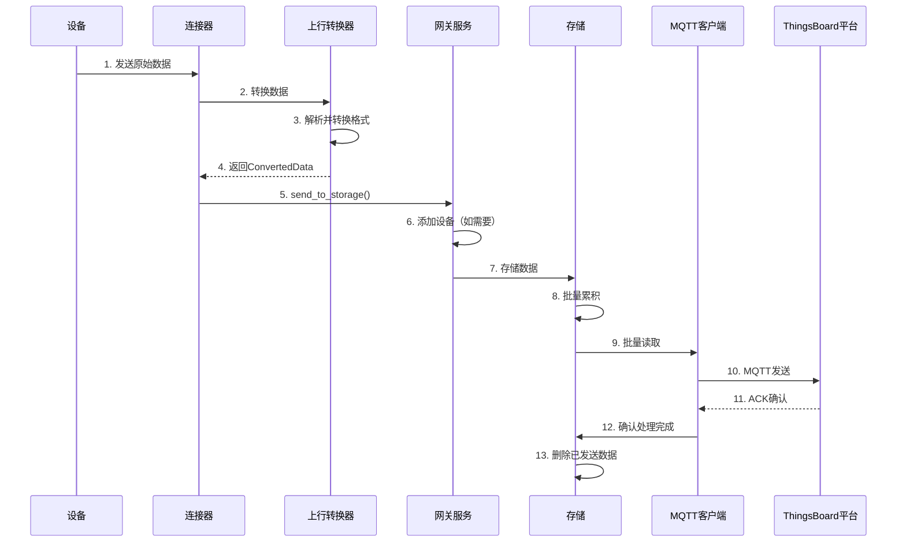

### 下行数据流（平台→设备）

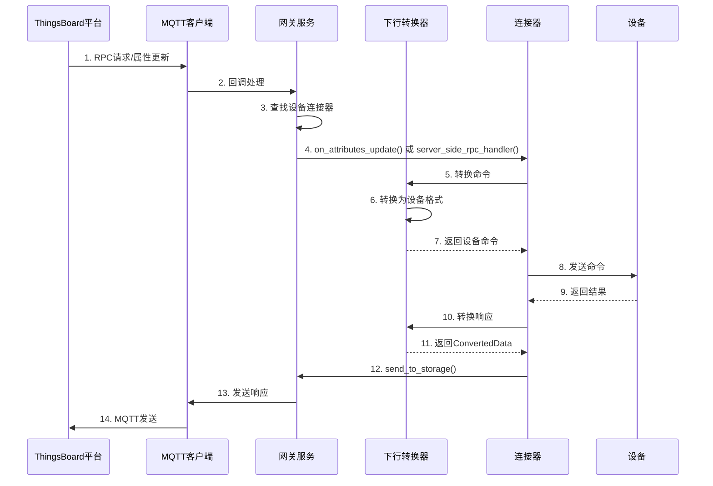

## 3. 类图

### 核心类关系

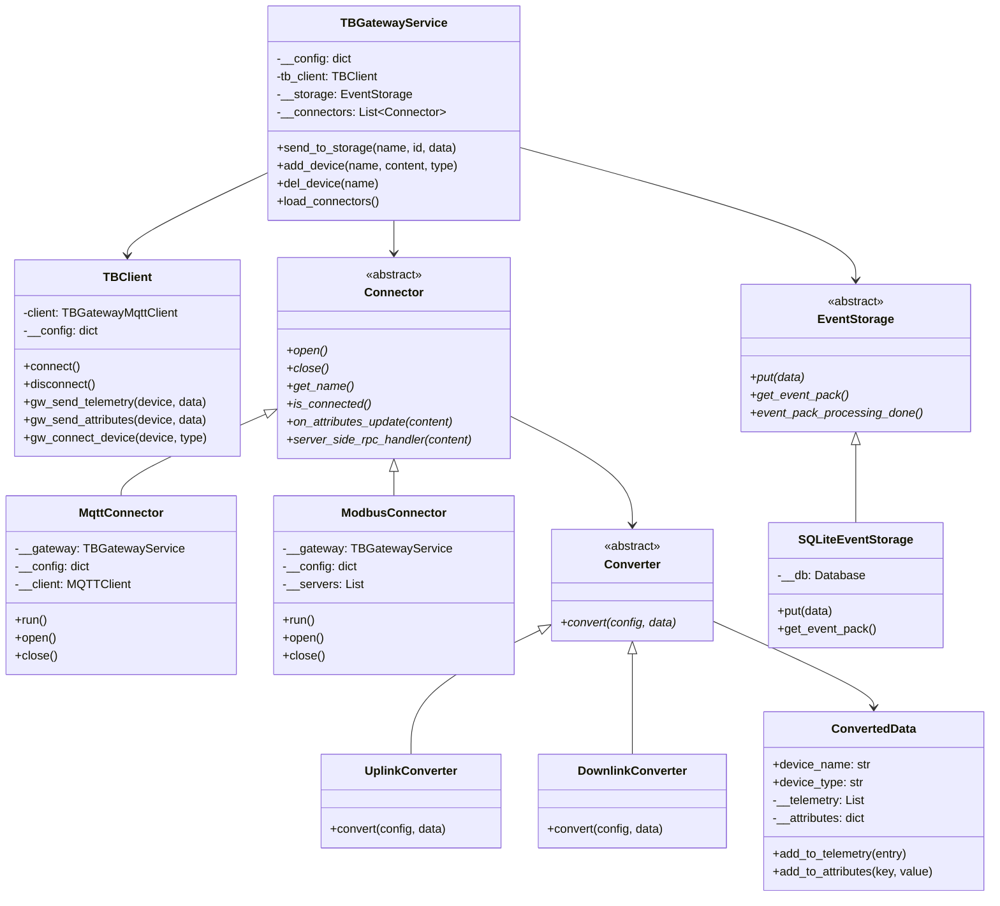

## 4. 组件交互图

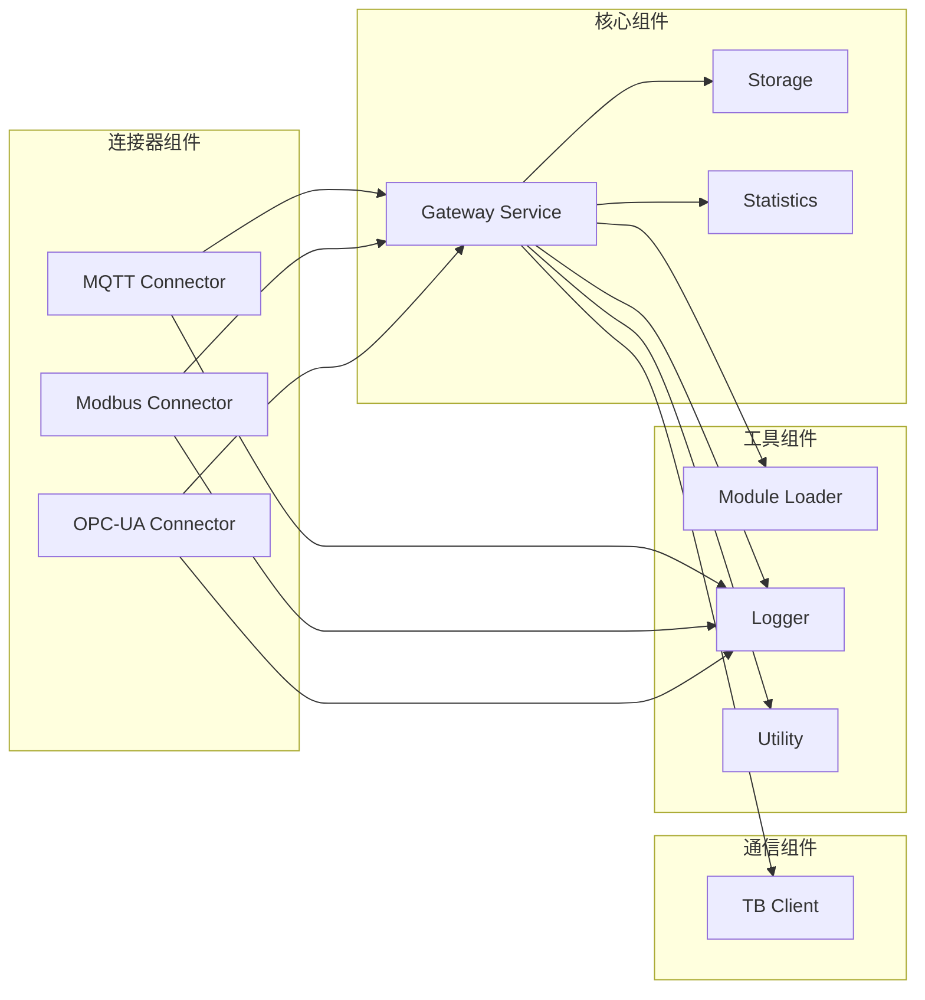

## 5. 线程模型

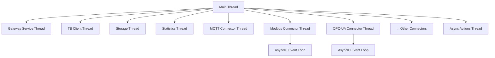

## 6. 存储系统架构

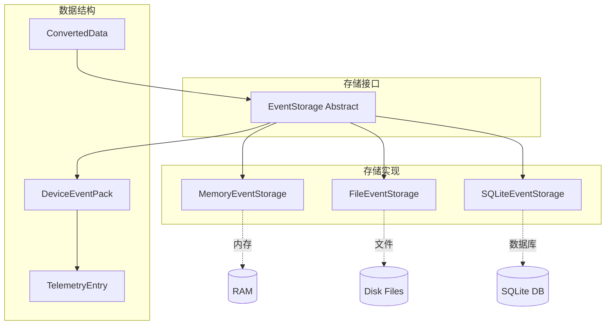

## 7. 配置管理架构

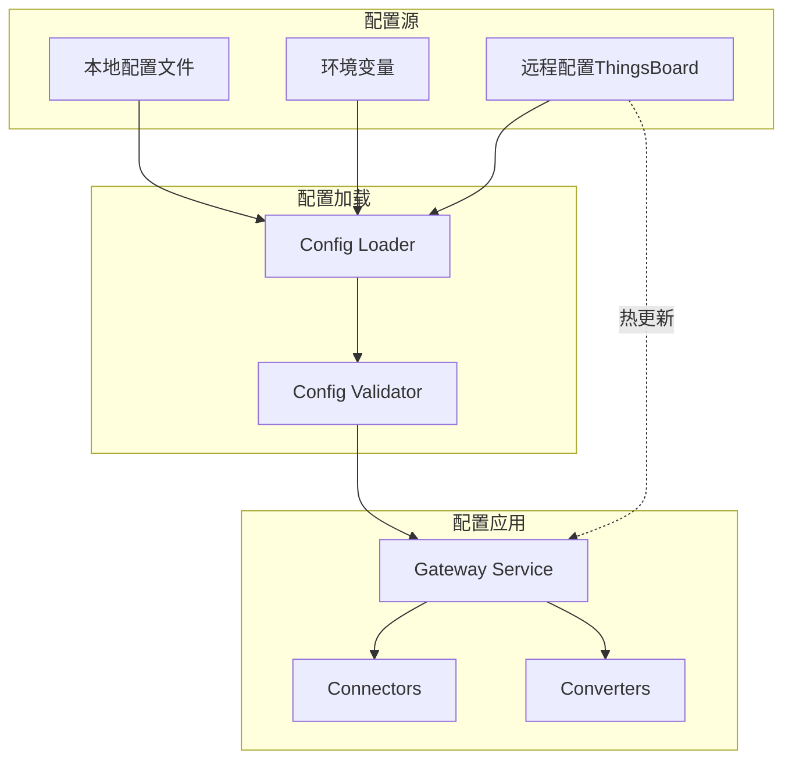

## 8. 连接器生命周期

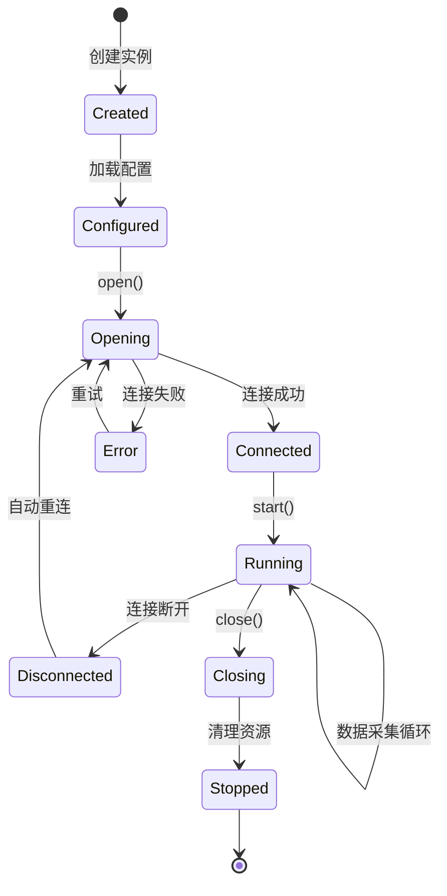

## 9. 数据转换流程

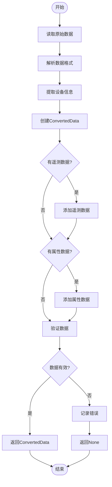

## 10. 部署架构

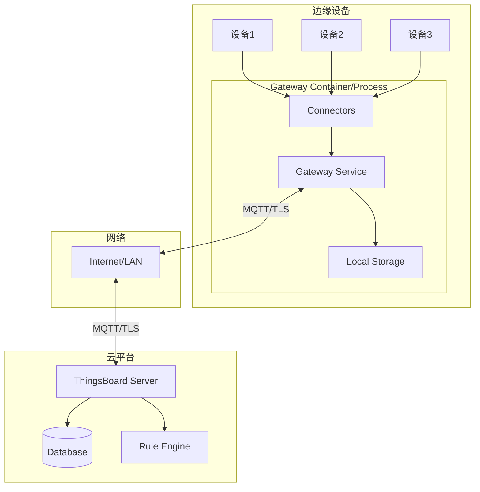

## 使用说明

这些图表可以帮助您：

1. **理解整体架构**: 查看系统架构图了解各层次关系
2. **追踪数据流**: 通过序列图了解数据如何在系统中流动
3. **学习类设计**: 类图展示了核心类的结构和关系
4. **掌握线程模型**: 了解多线程如何协同工作
5. **理解状态转换**: 状态图展示连接器的生命周期

建议结合源代码和这些图表一起学习，可以更快地掌握项目架构。

