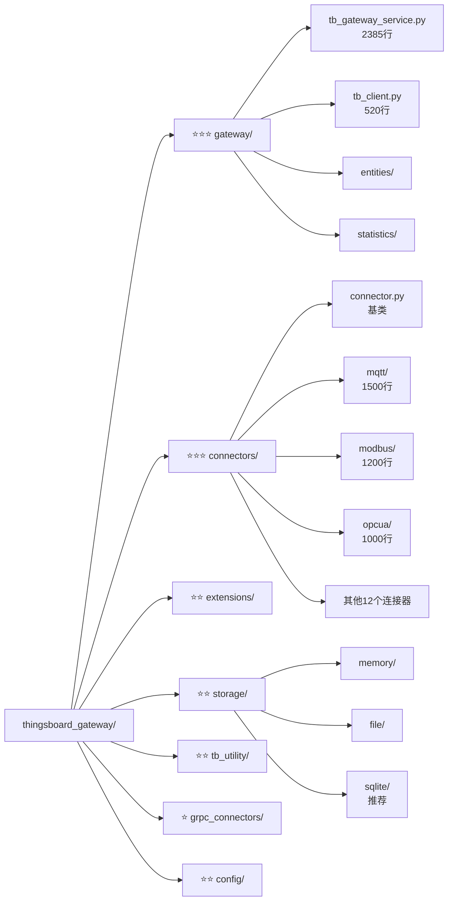
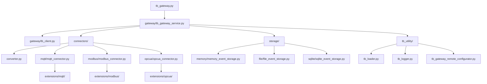
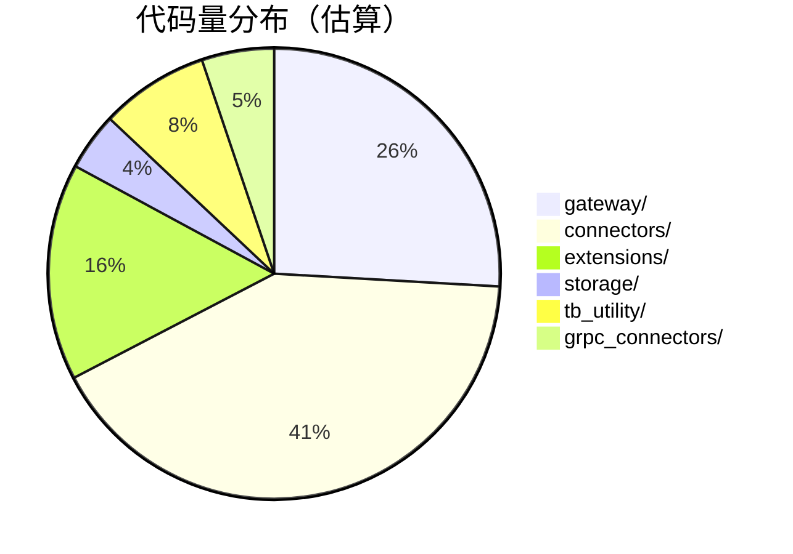

# thingsboard_gateway/ 目录结构可视化

本文档使用树形图和Mermaid图表展示 `thingsboard_gateway/` 目录的完整结构。

## 📊 完整目录树

```
thingsboard_gateway/
│
├── 📄 __init__.py                          # Python包初始化
├── 📄 tb_gateway.py                        # ⭐ 主入口文件（76行）
├── 📄 version.py                           # 版本号：3.7.8
│
├── 📁 config/                              # 配置文件目录（20+个文件）
│   ├── tb_gateway.json                     # ⭐ 主配置文件
│   ├── logs.json                           # 日志配置
│   ├── mqtt.json                           # MQTT连接器配置
│   ├── modbus.json                         # Modbus TCP配置
│   ├── modbus_serial.json                  # Modbus RTU配置
│   ├── opcua.json                          # OPC-UA配置
│   ├── bacnet.json                         # BACnet配置
│   ├── ble.json                            # 蓝牙配置
│   ├── can.json                            # CAN总线配置
│   ├── rest.json                           # REST API配置
│   ├── request.json                        # HTTP请求配置
│   ├── socket.json                         # Socket配置
│   ├── snmp.json                           # SNMP配置
│   ├── ftp.json                            # FTP配置
│   ├── xmpp.json                           # XMPP配置
│   ├── ocpp.json                           # OCPP充电桩配置
│   ├── odbc.json                           # 数据库配置
│   ├── knx.json                            # KNX建筑自动化配置
│   ├── custom_serial.json                  # 自定义串口配置
│   ├── list.json                           # 连接器列表
│   └── statistics/                         # 统计配置目录
│
├── 📁 gateway/                             # ⭐⭐⭐ 网关核心目录（~5000行代码）
│   ├── __init__.py
│   ├── tb_gateway_service.py               # ⭐ 核心服务（2385行）
│   ├── tb_client.py                        # ⭐ ThingsBoard客户端（520行）
│   ├── constants.py                        # 常量定义（162行）
│   ├── constant_enums.py                   # 枚举常量
│   ├── device_filter.py                    # 设备过滤器
│   ├── hot_reloader.py                     # 热重载功能
│   │
│   ├── entities/                           # 数据实体目录
│   │   ├── __init__.py
│   │   ├── converted_data.py               # ⭐ ConvertedData类（242行）
│   │   ├── telemetry_entry.py              # TelemetryEntry类
│   │   ├── datapoint_key.py                # DatapointKey类
│   │   ├── attributes.py                   # Attributes类
│   │   ├── device_event_pack.py            # DeviceEventPack类
│   │   └── report_strategy_config.py       # 报告策略配置
│   │
│   ├── grpc_service/                       # gRPC服务目录
│   │   ├── __init__.py
│   │   ├── tb_grpc_server.py               # gRPC服务器
│   │   ├── tb_grpc_manager.py              # gRPC管理器
│   │   ├── grpc_connector.py               # gRPC连接器
│   │   ├── grpc_uplink_converter.py        # gRPC上行转换
│   │   └── grpc_downlink_converter.py      # gRPC下行转换
│   │
│   ├── proto/                              # Protobuf定义
│   │   ├── __init__.py
│   │   ├── messages.proto                  # 消息定义
│   │   ├── messages_pb2.py                 # 生成的Python代码
│   │   └── messages_pb2_grpc.py            # 生成的gRPC代码
│   │
│   ├── report_strategy/                    # 报告策略目录
│   │   ├── __init__.py
│   │   ├── report_strategy_service.py      # 报告策略服务
│   │   └── report_strategy_data_cache.py   # 数据缓存
│   │
│   ├── shell/                              # 远程Shell目录
│   │   ├── __init__.py
│   │   ├── shell.py                        # Shell实现
│   │   └── proxy.py                        # Shell代理
│   │
│   └── statistics/                         # 统计服务目录
│       ├── __init__.py
│       ├── statistics_service.py           # ⭐ 统计服务
│       ├── decorators.py                   # 统计装饰器
│       ├── service_functions.py            # 服务函数
│       └── configs.py                      # 统计配置
│
├── 📁 connectors/                          # ⭐⭐⭐ 连接器目录（~8000行代码）
│   ├── __init__.py
│   ├── connector.py                        # ⭐ 连接器基类（抽象类）
│   ├── converter.py                        # ⭐ 转换器基类（抽象类）
│   │
│   ├── mqtt/                               # MQTT连接器（~1500行）
│   │   ├── __init__.py
│   │   ├── mqtt_connector.py               # ⭐ MQTT连接器主类
│   │   ├── mqtt_uplink_converter.py        # 上行转换器基类
│   │   ├── json_mqtt_uplink_converter.py   # JSON转换器
│   │   ├── bytes_mqtt_uplink_converter.py  # 字节转换器
│   │   ├── mqtt_decorators.py              # 装饰器
│   │   └── backward_compatibility_adapter.py # 兼容适配器
│   │
│   ├── modbus/                             # Modbus连接器（~1200行）
│   │   ├── __init__.py
│   │   ├── modbus_connector.py             # ⭐ Modbus连接器
│   │   ├── bytes_modbus_uplink_converter.py
│   │   └── bytes_modbus_downlink_converter.py
│   │
│   ├── opcua/                              # OPC-UA连接器（~1000行）
│   │   ├── __init__.py
│   │   ├── opcua_connector.py              # ⭐ OPC-UA连接器
│   │   ├── opcua_uplink_converter.py
│   │   └── opcua_downlink_converter.py
│   │
│   ├── bacnet/                             # BACnet连接器
│   │   ├── __init__.py
│   │   └── bacnet_connector.py
│   │
│   ├── ble/                                # 蓝牙连接器
│   │   ├── __init__.py
│   │   └── ble_connector.py
│   │
│   ├── can/                                # CAN总线连接器
│   │   ├── __init__.py
│   │   └── can_connector.py
│   │
│   ├── rest/                               # REST API连接器
│   │   ├── __init__.py
│   │   └── rest_connector.py
│   │
│   ├── request/                            # HTTP请求连接器
│   │   ├── __init__.py
│   │   └── request_connector.py
│   │
│   ├── socket/                             # Socket连接器
│   │   ├── __init__.py
│   │   └── socket_connector.py
│   │
│   ├── snmp/                               # SNMP连接器
│   │   ├── __init__.py
│   │   └── snmp_connector.py
│   │
│   ├── ftp/                                # FTP连接器
│   │   ├── __init__.py
│   │   └── ftp_connector.py
│   │
│   ├── xmpp/                               # XMPP连接器
│   │   ├── __init__.py
│   │   └── xmpp_connector.py
│   │
│   ├── ocpp/                               # OCPP充电桩连接器
│   │   ├── __init__.py
│   │   └── ocpp_connector.py
│   │
│   ├── odbc/                               # ODBC数据库连接器
│   │   ├── __init__.py
│   │   └── odbc_connector.py
│   │
│   └── knx/                                # KNX建筑自动化连接器
│       ├── __init__.py
│       └── knx_connector.py
│
├── 📁 extensions/                          # ⭐⭐ 扩展和转换器目录（~3000行）
│   ├── __init__.py
│   │
│   ├── mqtt/                               # MQTT转换器
│   │   ├── json_mqtt_uplink_converter.py
│   │   ├── json_mqtt_downlink_converter.py
│   │   └── custom_mqtt_uplink_converter.py
│   │
│   ├── modbus/                             # Modbus转换器
│   │   ├── bytes_modbus_uplink_converter.py
│   │   └── bytes_modbus_downlink_converter.py
│   │
│   ├── opcua/                              # OPC-UA转换器
│   │   ├── opcua_uplink_converter.py
│   │   └── opcua_downlink_converter.py
│   │
│   ├── bacnet/                             # BACnet转换器
│   ├── ble/                                # BLE转换器
│   ├── can/                                # CAN转换器
│   ├── rest/                               # REST转换器
│   ├── request/                            # Request转换器
│   ├── socket/                             # Socket转换器
│   ├── snmp/                               # SNMP转换器
│   ├── ftp/                                # FTP转换器
│   ├── xmpp/                               # XMPP转换器
│   ├── ocpp/                               # OCPP转换器
│   ├── odbc/                               # ODBC转换器
│   ├── knx/                                # KNX转换器
│   ├── serial/                             # 串口转换器
│   ├── modbus_old/                         # 旧版Modbus转换器
│   └── bacnet_old/                         # 旧版BACnet转换器
│
├── 📁 storage/                             # ⭐⭐ 存储系统目录（~800行）
│   ├── __init__.py
│   ├── event_storage.py                    # ⭐ 存储抽象基类
│   │
│   ├── memory/                             # 内存存储
│   │   ├── __init__.py
│   │   └── memory_event_storage.py         # 内存存储实现
│   │
│   ├── file/                               # 文件存储
│   │   ├── __init__.py
│   │   ├── file_event_storage.py           # 文件存储主类
│   │   ├── event_storage_files.py          # 文件管理
│   │   ├── event_storage_reader.py         # 文件读取器
│   │   ├── event_storage_writer.py         # 文件写入器
│   │   ├── event_storage_reader_pointer.py # 读取指针
│   │   └── file_event_storage_settings.py  # 文件存储配置
│   │
│   └── sqlite/                             # ⭐ SQLite存储（推荐）
│       ├── __init__.py
│       ├── sqlite_event_storage.py         # SQLite存储主类
│       ├── database.py                     # 数据库管理
│       ├── database_connector.py           # 数据库连接
│       ├── sqlite_event_storage_pointer.py # 读取指针
│       └── storage_settings.py             # 存储配置
│
├── 📁 grpc_connectors/                     # ⭐ gRPC连接器目录（~1000行）
│   ├── __init__.py
│   ├── gw_grpc_client.py                   # gRPC客户端
│   ├── gw_grpc_connector.py                # gRPC连接器
│   ├── gw_grpc_msg_creator.py              # 消息创建器
│   ├── gw_msg_callbacks.py                 # 消息回调
│   │
│   ├── modbus/                             # Modbus gRPC
│   ├── mqtt/                               # MQTT gRPC
│   ├── opcua/                              # OPC-UA gRPC
│   └── socket/                             # Socket gRPC
│
└── 📁 tb_utility/                          # ⭐⭐ 工具类目录（~1500行）
    ├── __init__.py
    ├── tb_utility.py                       # ⭐ 通用工具类
    ├── tb_loader.py                        # ⭐ 模块加载器
    ├── tb_logger.py                        # 日志工具
    ├── tb_gateway_remote_configurator.py   # 远程配置器
    ├── tb_remote_shell.py                  # 远程Shell
    ├── tb_updater.py                       # 自动更新器
    ├── tb_handler.py                       # 处理器
    └── tb_rotating_file_handler.py         # 日志轮转处理器
```

## 📈 目录重要性评级



## 🔄 模块依赖关系



## 📊 代码量分布



## 🎯 核心文件热力图

| 文件 | 代码行数 | 复杂度 | 重要性 | 修改频率 |
|------|---------|--------|--------|---------|
| tb_gateway_service.py | 2385 | 🔥🔥🔥🔥🔥 | ⭐⭐⭐ | 高 |
| mqtt_connector.py | 1500 | 🔥🔥🔥🔥 | ⭐⭐⭐ | 中 |
| modbus_connector.py | 1200 | 🔥🔥🔥🔥 | ⭐⭐⭐ | 中 |
| opcua_connector.py | 1000 | 🔥🔥🔥🔥 | ⭐⭐⭐ | 中 |
| tb_client.py | 520 | 🔥🔥🔥 | ⭐⭐⭐ | 中 |
| converted_data.py | 242 | 🔥🔥 | ⭐⭐⭐ | 低 |
| connector.py | 150 | 🔥 | ⭐⭐⭐ | 低 |
| converter.py | 100 | 🔥 | ⭐⭐⭐ | 低 |

## 相关文档

- [thingsboard_gateway目录详解](thingsboard_gateway目录详解.md) - 详细的文字说明
- [架构设计](02-architecture.md) - 系统架构
- [核心组件](03-core-components.md) - 组件详解

